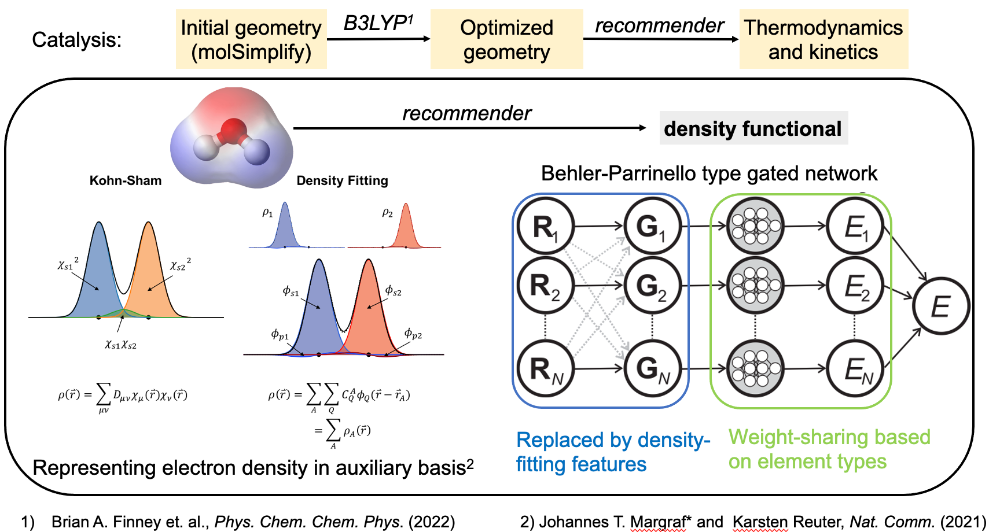
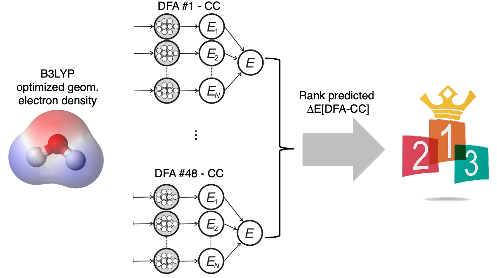

.. dfa_recommender documentation master file, created by
   sphinx-quickstart on Thu Mar 15 13:55:56 2018.
   You can adapt this file completely to your liking, but it should at least
   contain the root `toctree` directive.

Welcome to dfa_recommender's documentation!
=========================================================

.. toctree::
   :maxdepth: 2
   :caption: Model and approach

.. toctree::
   :maxdepth: 2
   :caption: Contents:

.. toctree::
   :maxdepth: 2 
   :caption: General Information

   Installation
   Citation
   API
   Tutorials

Indices and tables
==================

* :ref:`genindex`
* :ref:`modindex`
* :ref:`search`
